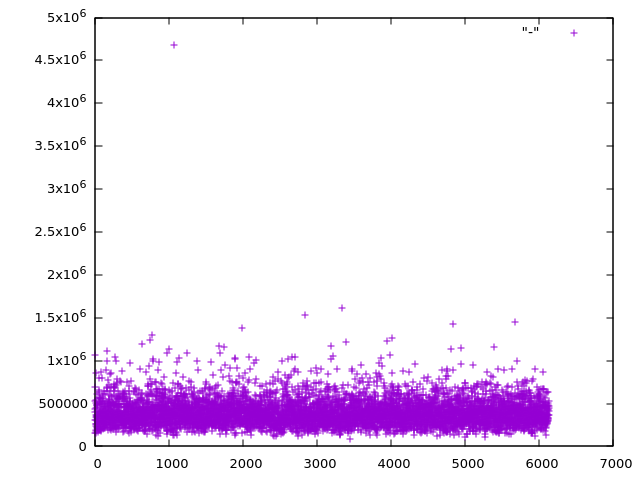

# Ros2TraceAnalyzer

Ros2TraceAnalyzer is a fast command-line tool to extract useful data from LTTng traces of ROS applications.

## Supported ROS versions

- Jazzy

## Installation

First make sure you have development version of Babeltrace 2 library. It can be installed on Ubuntu using:

```sh
apt install libbabeltrace2-dev
```

The Ros2TraceAnalyzer can then be compiled and installed using `cargo` by running:

```sh
cargo install --git https://github.com/skoudmar/Ros2TraceAnalyzer.git
```

Compilation should work with at least Rust version 1.83. Currently, we
don't make any guarantees for minimum supported Rust version.

## Usage

Record traces of your ROS application:

- Either by installing [`ros2trace`][] and running:

  ```sh
  ros2 trace -u 'ros2:*' 'r2r:*'
  ```

  The traces will be available in `$HOME/.ros/tracing/session-<timestamp>`.

- Alternatively, you can trace your application directly with LTTng:

  ```sh
  # Session name is an optional user-chosen name for the trace
  lttng create [session-name]
  lttng enable-event -u 'ros2:*,r2r:*'
  lttng add-context -u --type=vtid --type=vpid --type=procname
  lttng start
  # Start the ROS system here.
  # Let it run for as long as you want to trace it.
  lttng destroy
  ```

  The traces will be available in `$HOME/lttng-traces/<session-name>-<timestamp>`.

Then you can use `Ros2TraceAnalyzer` subcommands to obtain various
information from the trace.

<!-- `$ cargo run -- -h | sed '/Options:/,$ d'` -->

```
Usage: Ros2TraceAnalyzer [OPTIONS] <TRACE_PATHS>... <COMMAND>

Commands:
  dependency-graph  Construct a detailed dependency graph with timing statistics
  message-latency   Analyze the latency of the messages
  callback          Analyze the callback duration and inter-arrival time
  utilization       Analyze the utilization of the system based on the quantile callback durations
  utilization-real  Analyze the utilization of the system based on the real execution times
  all               Run all analyses
  help              Print this message or the help of the given subcommand(s)

Arguments:
  <TRACE_PATHS>...  Paths to directories to search for the trace to analyze

```

To gain **overview of timing in your application**, generate a
dependency graph and view it with [xdot.py][]:

```sh
Ros2TraceAnalyzer ~/lttng-traces/session-20240123-123456 dependency-graph -o graph/ --thickness
xdot graph/dependency_graph.dot
```

You will see something similar to this figure, where tooltips show
quantiles of measured timing parameters:


> [!NOTE]
> Latest xdot relase (1.4) doesn't display newlines in tooltips
> correctly. To see tooltips correctly, use the master branch.

Selected options for dependency-graph:
- `-o, --output-dir <DIR>` Mandatory option specifying the output
  directory for the graph
- `--color` Color edges based on their median latency
- `--thickness` Set edge thickness based on their median latency
- `--min-multiplier <MIN_MULT>` Set the maximum value of the color or
  thickness range to be lower bounded by `MIN_MULT` multiple of the
  minimum value, i.e. the range will be: [min, _max_(max, min *
  `MIN_MULT`)]

**Message latency** and **Callback** analyze message latencies and
callback execution and inter-arrival times. The resulting data can be
printed to stdout in aggregated form or exported in full to a JSON
file. Supported options are:

- `--quantiles <QUANTILES>...` Print results with these quantiles.
- `--json-dir <JSON_DIR_PATH>` Instead of printing aggregated results,
  export the measured data into a JSON file in the specified
  directory.

You can visualize individual data by using Jupyter notebooks in the
[py-src](./py-src/) directory or directly via command line, for
example, as follows:

```sh
jq '.[]|select(.topic=="/clock" and .subscriber_node=="/rviz2")|.latencies[]' json/message_latency.json | gnuplot -p -e 'plot "-"'
```



**Utilization** analysis allow to estimate CPU utilization by
individual threads for different quantiles of callback execution
times. To analyze theoretical worst-case utilization, add `--quantile 1.0`. For median utilization, use `--quantile 0.5`.

Example output of utilization analysis is shown below:

```sh
Ros2TraceAnalyzer ~/lttng-traces/session-20240123-123456 dependency-graph utilization --quantile 0.5
```

```
Utilization statistics for duration quantile 0.5:
Thread 1737379 on steelpick has utilization 36.13906 %
     36.13906 % from Callback (node="/transform_listener_impl_2e3cec40", Subscriber("/tf_static"))
Thread 1737381 on steelpick has utilization 14.44460 %
     14.32256 % from Callback (node="/transform_listener_impl_2e4c2f70", Subscriber("/tf_static"))
      0.12204 % from Callback (node="/transform_listener_impl_2e4c2f70", Subscriber("/tf"))
Thread 1737160 on steelpick has utilization  1.85107 %
      1.80842 % from Callback (node="/alks", Timer(20 ms))
      0.02318 % from Callback (node="/alks", Subscriber("/clock"))
      0.00425 % from Callback (node="/alks", Subscriber("/FR/EPS/LHEPS04"))
      0.00302 % from Callback (node="/alks", Subscriber("/FR/ZFAS/EML04"))
      0.00261 % from Callback (node="/alks", Subscriber("/FR/ESP_PAG/ESP21"))
      0.00242 % from Callback (node="/alks", Subscriber("/FR/ZFAS/BV2LinienEgoLinks"))
      0.00194 % from Callback (node="/alks", Subscriber("/FR/ZFAS/BV2LinienEgoRechts"))
      0.00181 % from Callback (node="/alks", Subscriber("/joy"))
      0.00176 % from Callback (node="/alks", Subscriber("/FR/ZFAS/BV2LinienNebenspuren"))
      0.00167 % from Callback (node="/alks", Subscriber("/FR/ZFAS/EML01"))
```

[`ros2trace`]: https://index.ros.org/p/ros2trace/
[xdot.py]: https://github.com/jrfonseca/xdot.py
